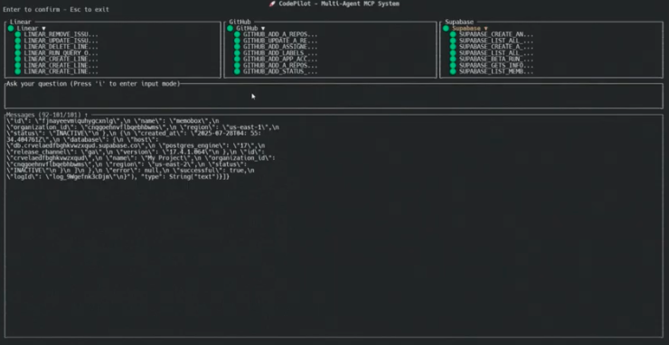

# CodePilot

A powerful, multi-agent CLI tool that orchestrates AI agents to interact with Linear, GitHub, and Supabase through Model Context Protocol (MCP) servers with an integration layer powered by [Composio](https://composio.dev).

## Overview

CodePilot is a Rust-based terminal application that provides an intelligent interface for managing project workflows across multiple platforms. It uses specialized AI agents to understand user queries and execute appropriate actions through MCP servers.



### Technology Stack

- **Language**: Rust
- **Async Runtime**: Tokio
- **UI Framework**: Ratatui + Crossterm
- **AI Framework**: swarms-rs
- **HTTP Client**: Reqwest
- **Serialization**: Serde + Serde JSON
- **Error Handling**: Anyhow
- **Configuration**: dotenv
- **Date/Time**: Chrono

### Key Features

- **Multi-Agent Architecture**: Specialized agents for Linear, GitHub, and Supabase
- **Dynamic Tool Discovery**: Tools fetched from MCP servers at runtime
- **Intelligent Query Routing**: Automatic agent selection based on query content
- **Interactive Terminal UI**: Modern interface with real-time status updates
- **Robust Error Handling**: Graceful fallbacks and helpful error messages
- **Type Safety**: Rust's type system ensures reliability
- **Async Operations**: Concurrent operations with Tokio runtime

## Installation

### Prerequisites

- Rust 1.70+ and Cargo
- API keys for:
  - OpenAI (for AI processing)
  - Linear (for project management)
  - GitHub (for repository operations)
  - Supabase (for database operations)

### Build

```bash
# Build the project
cargo build --release

# Run the application
cargo run
```

## Configuration

Create a `.env` file in the project root with your API keys:

```env
OPENAI_API_KEY=your_openai_api_key
OPENAI_BASE_URL=https://api.openai.com/v1
LINEAR_API_KEY=your_linear_api_key
GITHUB_TOKEN=your_github_token
SUPABASE_URL=your_supabase_url
SUPABASE_KEY=your_supabase_anon_key
```

## Usage

### Starting the Application

```bash
cargo run
```

The application will start an interactive terminal UI where you can:

1. **Enter queries** in natural language
2. **View real-time status** of operations
3. **See formatted responses** from different services
4. **Navigate through results** using keyboard shortcuts

### Example Queries

- **Linear**: "Create a new issue in the backend project"
- **GitHub**: "List all open pull requests in the main repository"
- **Supabase**: "Show me the latest user registrations"

## Project Structure

```
codepilot/
├── src/
│   ├── main.rs              # Application entry point
│   ├── lib.rs               # Library exports
│   ├── cli/                 # CLI application logic
│   ├── agents/              # AI agent implementations
│   │   ├── linear.rs        # Linear project management agent
│   │   ├── github.rs        # GitHub repository agent
│   │   └── supabase.rs      # Supabase database agent
│   ├── clients/             # MCP client implementations
│   │   ├── linear.rs        # Linear MCP client
│   │   ├── github.rs        # GitHub MCP client
│   │   └── supabase.rs      # Supabase MCP client
│   ├── config/              # Configuration management
│   ├── orchestrator.rs      # Multi-agent orchestration
│   └── formatter.rs         # Response formatting
├── Cargo.toml               # Rust dependencies
├── ARCHITECTURE.md          # Detailed architecture docs
└── README.md               # This file
```

## How It Works

### 1. Query Processing
- User enters a natural language query
- The query is routed to the appropriate agent based on content analysis
- The selected agent processes the query using OpenAI's GPT-4 Turbo

### 2. Tool Discovery
- Agents discover available tools from MCP servers
- Tools are scored for relevance to the current query
- The most relevant tool is selected for execution

### 3. Tool Execution
- Selected tools are executed through MCP clients
- MCP servers communicate with external APIs
- Results are formatted and displayed to the user

### 4. Response Handling
- Responses are formatted for optimal readability
- Status updates are shown in real-time
- Error handling provides graceful fallbacks

## Development

### Building for Development

```bash
# Development build
cargo build

# Run with logging
RUST_LOG=debug cargo run
```

### Testing

```bash
# Run all tests
cargo test

# Run specific test
cargo test test_name
```

### Code Quality

```bash
# Format code
cargo fmt

# Lint code
cargo clippy
```
